# All World Trade — B2B Trade Networking Platform

> **Version:** 9.0.0 | **System Type:** B2B Trade Networking & Marketplace Platform | **Architecture:** Monolithic SSR (Server-Side Rendered)

---

## Table of Contents

1. [Project Overview](#1-project-overview)
2. [System Features](#2-system-features)
3. [System Architecture](#3-system-architecture)
4. [System Design](#4-system-design)
5. [Folder Structure](#5-folder-structure)
6. [Frontend Architecture](#6-frontend-architecture)
7. [Backend Architecture](#7-backend-architecture)
8. [API Documentation](#8-api-documentation)
9. [Complete Data Flow](#9-complete-data-flow)
10. [Database Design](#10-database-design)
11. [Entity Relationship Diagram](#11-entity-relationship-diagram)
12. [Authentication & Security](#12-authentication--security)
13. [Deployment Architecture](#13-deployment-architecture)
14. [Environment Configuration](#14-environment-configuration)
15. [Installation & Setup](#15-installation--setup)
16. [Technology Stack](#16-technology-stack)
17. [Scalability & Performance](#17-scalability--performance)
18. [Error Handling](#18-error-handling)
19. [Testing Strategy](#19-testing-strategy)
20. [Future Improvements](#20-future-improvements)

---

## 1. Project Overview

### What Is All World Trade?

All World Trade is a **B2B trade networking and business discovery platform** that connects businesses across four tiers:

| Tier | Type | Description |
|------|------|-------------|
| Type 1 | **Trader** | Individual businessperson / sole proprietor |
| Type 2 | **Large-Scale Company** | Enterprise-level organization |
| Type 3 | **Medium-Scale Company** | Mid-market business |
| Type 4 | **Small-Scale Company** | Small business / startup |

### What Problem Does It Solve?

Businesses struggle to find reliable trade partners, suppliers, and customers across different scales and geographies. Traditional trade shows and directories are static, expensive, and lack real-time interaction. All World Trade solves this by providing:

- **A discoverable directory** of businesses categorized by scale, industry, and location
- **Rich multimedia profiles** (logos, banners, videos, brochures, webinars)
- **Real-time video meetings** built directly into the platform
- **Targeted visibility controls** — businesses choose who can see them
- **Visitor-trader connection tracking** with downloadable meeting records

### Target Users

- SMEs and micro-enterprises seeking B2B partners
- Large corporations looking for regional distributors or suppliers
- Individual traders and entrepreneurs
- Trade show organizers and business matchmakers

### Core Business Logic

The platform operates on a **visibility-and-connection model**:

1. Businesses **register** with a specific tier (Trader, Small, Medium, Large)
2. They **create rich profiles** with media, characteristics, and visibility settings
3. Other users **search and discover** businesses by location, industry, category, or scale
4. Users **connect** via built-in video meetings or contact requests
5. Each interaction is **recorded** as a visitor-trader meeting with downloadable PDF records
6. **Analytics** track logins, profile views, downloads, and connections

---

## 2. System Features

### 2.1 Multi-Tier Registration

| Aspect | Detail |
|--------|--------|
| **Description** | Separate registration flows for Traders, Small, Medium, and Large companies |
| **Purpose** | Each tier has different data requirements and visibility options |
| **How It Works** | A unified registration (v2) flow collects tier-specific data through conditional forms; legacy flows exist for backward compatibility |
| **Technologies** | EJS forms, Express-validator, Sequelize ORM, Multer (file upload) |

### 2.2 Rich Business Profiles

| Aspect | Detail |
|--------|--------|
| **Description** | Businesses can upload logos, banners, videos, brochures, and webinars |
| **Purpose** | Provide comprehensive multimedia representation to attract partners |
| **How It Works** | Multer handles multipart uploads; Sharp processes images; files stored in `public/uploads/` |
| **Technologies** | Multer, Sharp, PDFKit, EJS views |

### 2.3 Business Visibility Controls

| Aspect | Detail |
|--------|--------|
| **Description** | Granular control over who can see a business profile |
| **Purpose** | Businesses can target specific geographic levels and audience sizes |
| **How It Works** | Visibility settings stored in `users_business_visibility` table; applied as filters during search queries |
| **Technologies** | MySQL queries, EJS checkboxes, Sequelize models |

### 2.4 Company Search & Discovery

| Aspect | Detail |
|--------|--------|
| **Description** | Search by location, language, business scale, trade categories, products |
| **Purpose** | Enable targeted B2B discovery |
| **How It Works** | A selection page with multiple filter criteria; queries join across businesses, characteristics, and visibility tables |
| **Technologies** | Express.js routes, MySQL joins, EJS templates |

### 2.5 Video Meeting System

| Aspect | Detail |
|--------|--------|
| **Description** | Built-in real-time video meetings via MiroTalk WebRTC integration |
| **Purpose** | Enable direct face-to-face communication between trading partners |
| **How It Works** | Each business gets a unique communicator link (UUID); Socket.io manages WebRTC peer connections; MiroTalk P2P library handles media streams |
| **Technologies** | Socket.io, MiroTalk P2P, WebRTC, UUID, Express.js |

### 2.6 Visitor-Trader Connection Tracking

| Aspect | Detail |
|--------|--------|
| **Description** | Every meeting between a visitor and a trader is recorded |
| **Purpose** | Provide an audit trail of business interactions |
| **How It Works** | `traders_visitors` table records each connection; PDF downloads available for both parties |
| **Technologies** | PDFKit, MySQL, EJS templates |

### 2.7 Email Notification System

| Aspect | Detail |
|--------|--------|
| **Description** | Automated emails for verification, password reset, contact notifications, and daily reports |
| **Purpose** | Keep users informed and engaged |
| **How It Works** | Nodemailer with Handlebars templates; node-cron triggers midnight reports; separate email marketing routes |
| **Technologies** | Nodemailer, Handlebars, node-cron, Express.js |

### 2.8 Help & Support System

| Aspect | Detail |
|--------|--------|
| **Description** | Dedicated support accounts with communicator links for customer assistance |
| **Purpose** | Provide real-time support through the same video meeting infrastructure |
| **How It Works** | Support accounts can create communicator links; users are assigned to support agents; chat messages are stored |
| **Technologies** | Socket.io, Sequelize (support_accounts, support_links, support_messages) |

### 2.9 Analytics & Reporting

| Aspect | Detail |
|--------|--------|
| **Description** | Daily metrics on logins, unique users, downloads, and profile views |
| **Purpose** | Monitor platform engagement and growth |
| **How It Works** | `user_sessions` and `user_download_histories` tables feed into daily cron reports |
| **Technologies** | node-cron, Nodemailer, MySQL aggregate queries |

---

## 3. System Architecture

### 3.1 High-Level Architecture

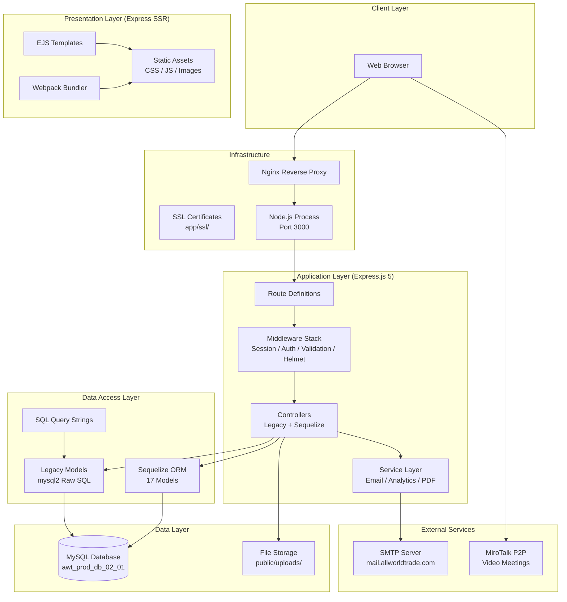

### 3.2 Architecture Decisions

| Decision | Rationale |
|----------|-----------|
| **Monolithic SSR** | The platform was built as a traditional server-rendered web app before the SPA era; keeps deployment simple (single process) |
| **Dual Data Access** | Legacy raw SQL coexists with Sequelize ORM; the ORM was introduced incrementally for new features without rewriting existing code |
| **Server-Side Rendering** | EJS templates are rendered on the server; SEO-friendly, faster initial page load, simpler state management |
| **Session Auth** | Chosen over JWT for simplicity in an SSR context; JWT is used only for password reset tokens |

### 3.3 Scalability Considerations

- **Vertical scaling**: Increase Node.js process resources (CPU/RAM)
- **Horizontal scaling**: Deploy behind a load balancer with multiple instances sharing session state via a Redis store
- **Database**: MySQL can be replicated (read replicas for search queries) or migrated to a managed service
- **Static assets**: Serve via CDN for reduced server load

### 3.4 Security Considerations

- Helmet is available (commented out) for security headers
- bcrypt for password hashing (12 rounds)
- AES encryption for UUID-based session data
- SSL termination at the application layer
- Rate limiting should be added at the Nginx layer

---

## 4. System Design

### 4.1 Design Patterns

| Pattern | Implementation |
|---------|---------------|
| **MVC (Model-View-Controller)** | Controllers handle HTTP logic, Models handle data, Views (EJS) handle presentation |
| **Service Layer** | `app/services/` encapsulates business logic (email, analytics, PDF generation) |
| **Repository Pattern** | `app/query/` files isolate SQL queries from controller logic |
| **Middleware Chain** | Express middleware stack handles cross-cutting concerns (auth, validation, session) |
| **Singleton** | Database connection pools (mysql2 pool, Sequelize instance) are created once |

### 4.2 Separation of Concerns

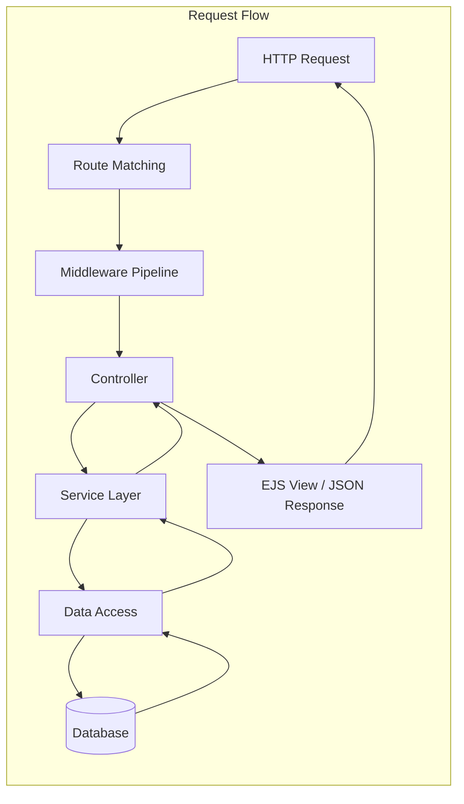

### 4.3 Client-Server Communication

- **Standard HTTP** for page navigation and form submissions
- **AJAX (jQuery)** for dynamic content loading (search, profile updates)
- **Socket.io** for real-time video meeting signaling and peer counting
- **Formats**: `application/x-www-form-urlencoded` (forms), `multipart/form-data` (file uploads), `application/json` (API)

### 4.4 State Management

- **Server-side**: Express session stored in memory (default) or configurable for Redis
- **Client-side**: Session cookie (`connect.sid`) for auth; minimal client state (jQuery-managed DOM)
- **No client-state framework** — the server is the single source of truth

### 4.5 Error Handling Strategy

- Express error-handling middleware catches unhandled errors
- Async controller errors are caught by a wrapper or `.catch()` chains
- Validation errors return structured JSON or re-render forms with error messages
- 404 handling for unmatched routes
- Structured logging via custom Logger utility

---

## 5. Folder Structure

```plaintext
all-world-trade-v11/
│
├── .env                          # Environment configuration
├── .gitignore
├── .prettierrc.js                # Code formatter config
├── package.json                  # Dependencies & scripts
├── package-lock.json
├── tailwind.config.js            # Tailwind CSS configuration
├── webpack.config.js             # JavaScript bundler config
│
├── app/                          # === CORE APPLICATION ===
│   ├── api/
│   │   ├── swagger.yaml          # MiroTalk meeting API spec
│   │   └── README.md
│   │
│   ├── config/                   # Application configuration
│   │   ├── db.config.js          # MySQL connection config (reads .env)
│   │   ├── email.config.js       # SMTP server config
│   │   └── sequelize.config.js   # Sequelize initialization
│   │
│   ├── controllers/              # Legacy controllers (34 files)
│   │   ├── login.controller.js
│   │   ├── traderRegistration.controller.js
│   │   ├── large-scale-company*.controller.js
│   │   ├── medium-scale-company*.controller.js
│   │   ├── small-scale-company*.controller.js
│   │   ├── categories.controller.js
│   │   ├── selection.controller.js
│   │   ├── users*.controller.js
│   │   └── ...
│   │
│   ├── db_controllers/           # Sequelize-based controllers (19 files)
│   │   ├── registration_v2.controller.js
│   │   ├── users-accounts.controller.js
│   │   ├── users-businesses.controller.js
│   │   ├── communicator.controller.js
│   │   ├── help-and-support.controller.js
│   │   └── ...
│   │
│   ├── db_models/                # Sequelize model definitions (17 models)
│   │   ├── index.js              # Barrel exports + db.sync()
│   │   ├── users.model.js
│   │   ├── users_accounts.model.js
│   │   ├── users_businesses.model.js
│   │   ├── users_address.model.js
│   │   ├── users_business_characteristics.model.js
│   │   ├── users_business_medias.model.js
│   │   ├── users_business_visibility.model.js
│   │   ├── traders_visitors.model.js
│   │   ├── user_sessions.model.js
│   │   ├── user_download_histories.model.js
│   │   ├── contact_requests.model.js
│   │   ├── reset_tokens.model.js
│   │   ├── support_accounts.model.js
│   │   ├── support_links.model.js
│   │   ├── support_messages.model.js
│   │   └── prospects.model.js
│   │
│   ├── email_controllers/        # Email logic
│   │   ├── cron-email.controller.js
│   │   └── submit-client-email-to-the-trader.controller.js
│   │
│   ├── middleware/               # Express middleware
│   │   ├── index.js              # Barrel exports
│   │   ├── helmet/               # CSP/security headers
│   │   ├── nonces/               # CSP nonce generation
│   │   └── validations/          # Express-validator rules
│   │       ├── login_process.validations.js
│   │       ├── registration_v2.validations.js
│   │       └── ...
│   │
│   ├── models/                   # Legacy models (37 files, raw SQL)
│   │   ├── db.js                 # mysql2 connection pool
│   │   ├── login.model.js
│   │   ├── categories.model.js
│   │   └── ...
│   │
│   ├── query/                    # Isolated SQL query strings (13 files)
│   │   ├── users.query.js
│   │   ├── users_accounts.query.js
│   │   ├── users_business.query.js
│   │   ├── users_business_medias.query.js
│   │   └── ...
│   │
│   ├── routes/                   # Route definitions (7 files)
│   │   ├── index.js              # Legacy API routes
│   │   ├── sequelize.route.js    # v2/v3 API routes
│   │   ├── upload-file.js        # File upload routes (30+ variants)
│   │   ├── password.js           # Hash/compare routes
│   │   ├── forgot-password.js    # Password reset routes
│   │   ├── encrypt.route.js      # AES encrypt/decrypt routes
│   │   └── email-marketing.js    # Email marketing routes
│   │
│   ├── service/                  # PDF generation
│   │   ├── pdf-service.js
│   │   └── pdf-trader.js
│   │
│   ├── services/                 # Business logic services
│   │   ├── analytics.service.js
│   │   └── email.service.js
│   │
│   ├── shared/                   # Shared utilities
│   │   ├── ecdc.js               # AES encrypt/decrypt
│   │   └── email-template.js
│   │
│   ├── src/                      # Server entry point
│   │   ├── server.js             # Main Express app (~1582 lines)
│   │   └── Logger.js             # Logging utility
│   │
│   ├── ssl/                      # SSL certificates
│   │   ├── cert.pem
│   │   ├── key.pem
│   │   └── README.md
│   │
│   └── utils/
│       └── date.utils.js         # Philippine timezone helpers
│
├── config/
│   └── config.json               # Sequelize CLI config (legacy)
│
├── migrations/                   # Sequelize migrations (2 files)
│   ├── 20220918073952-create-reset-token.js
│   └── 20220918091229-create-user.js
│
├── models/                       # Legacy Sequelize models (root level)
│   ├── index.js
│   ├── resettoken.js
│   └── user.js
│
├── public/                       # === FRONTEND ASSETS ===
│   ├── assets/
│   │   ├── css/                  # Custom stylesheets
│   │   ├── css-min/              # Minified CSS
│   │   ├── css-tailwind/         # Tailwind CSS output
│   │   ├── fonts/ & fonts2/      # Web fonts
│   │   ├── images/               # Static images
│   │   ├── js/                   # Frontend JavaScript (100+ files)
│   │   ├── js-min/               # Webpack-minified bundles
│   │   ├── json/                 # Geo data (countries, states, cities)
│   │   └── libs/                 # Third-party libraries
│   │
│   ├── assets2/                  # Secondary asset directory
│   ├── robots.txt
│   ├── uploads/                  # User-uploaded media files
│   │
│   └── view/                     # === EJS TEMPLATES ===
│       ├── home/
│       │   └── index.ejs         # Landing page
│       ├── includes/             # Shared partials (head, nav, footer)
│       ├── login/
│       ├── registration-v2/      # Unified registration flow
│       ├── selection/            # Company search page
│       ├── profile/              # User profile pages (tier-specific)
│       ├── upgrade/              # Plan upgrade pages
│       ├── pricing/
│       ├── forgot-password/
│       ├── reset-password/
│       ├── verification/
│       ├── traders-page/         # Public trader profile
│       ├── all-about-events/
│       ├── wizard-job-fair/
│       ├── legal/                # Terms, Privacy, Cookie policy
│       ├── test/
│       ├── modal/                # Reusable modal components
│       └── email/                # Handlebars email templates
│
└── README.md                     # This file
```

### Folder Role Summary

| Folder | Purpose | Responsibility |
|--------|---------|---------------|
| `app/config/` | Centralized configuration | Reads `.env` and exposes DB, email, and Sequelize configs |
| `app/controllers/` | Legacy request handlers | Receives HTTP requests, invokes models, returns responses |
| `app/db_controllers/` | Sequelize-based request handlers | Same role as controllers but uses ORM models |
| `app/db_models/` | Sequelize model definitions | Defines table schemas, associations, and defaults |
| `app/models/` | Legacy data access | Contains raw SQL via mysql2 pool |
| `app/query/` | Isolated SQL strings | Keeps SQL out of model files for maintainability |
| `app/routes/` | Route definitions | Maps HTTP methods+paths to controller functions |
| `app/middleware/` | Cross-cutting concerns | Validation, session, auth checks, CSP nonces |
| `app/services/` | Business logic | Email sending, analytics aggregation |
| `app/service/` | PDF generation | Creates downloadable PDF documents |
| `app/src/` | Application entry | Server bootstrap, middleware registration, listener |
| `app/shared/` | Utilities | Encryption helpers, email template functions |
| `app/email_controllers/` | Email handlers | Cron job email assembly, client notification emails |
| `public/view/` | EJS templates | All server-rendered HTML views |
| `public/assets/js/` | Client-side JS | jQuery-based DOM manipulation, AJAX calls, Socket.io |
| `public/assets/css/` | Stylesheets | Tailwind output, custom CSS, UIKit styles |
| `public/uploads/` | User content | Uploaded logos, banners, videos, brochures |

---

## 6. Frontend Architecture

### 6.1 Rendering Strategy

**Server-Side Rendering (SSR)** via EJS templates. The server compiles HTML with embedded JavaScript and sends the completed page to the browser.

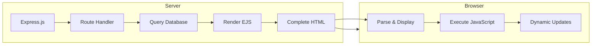

### 6.2 UI Structure

- **UIKit** provides the core UI component library (tabs, modals, accordions, grids)
- **Tailwind CSS** handles utility-first styling and responsive design
- **Flowbite** extends Tailwind with interactive components
- **Custom CSS** in `public/assets/css/` handles application-specific styling
- **Webpack** bundles JavaScript entry points (e.g., `home.js`)

### 6.3 Routing

Routes are defined server-side in `app/routes/`. Navigation is standard HTTP GET requests that trigger full page reloads (except where AJAX is used for dynamic interactions).

### 6.4 Client-Side Data Flow

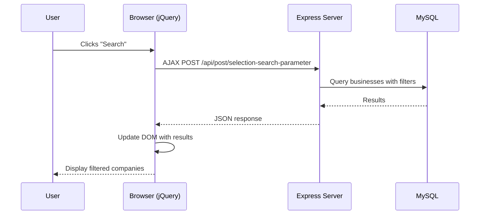

### 6.5 Authentication Handling (Frontend)

- Login form posts to `/api/post/login-process`
- Server sets session cookie on success
- EJS templates check `session.userId` to conditionally render authenticated content
- Logout hits `/logout` which destroys the session
- Protected routes check `req.session.userId` in middleware before rendering

### 6.6 Responsive Design

- Tailwind CSS breakpoints (sm, md, lg, xl, 2xl)
- UIKit's responsive grid system
- Mobile-first approach with utility classes

---

## 7. Backend Architecture

### 7.1 Request Lifecycle

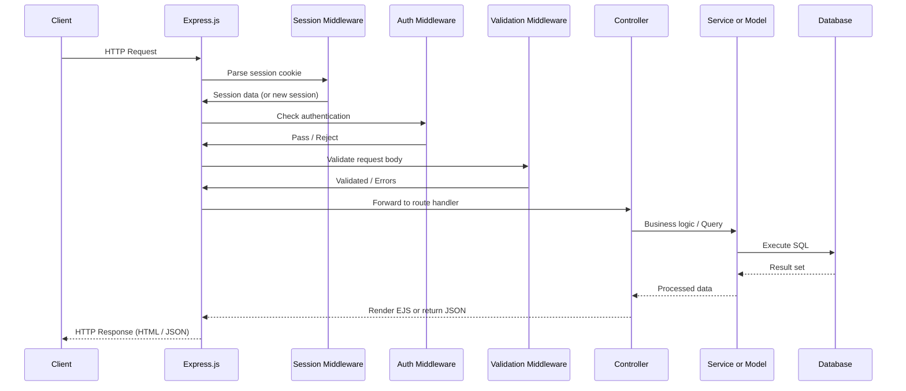

### 7.2 Controller Layer

Two parallel controller systems exist:

**Legacy Controllers** (`app/controllers/`):
- Directly use `mysql2` pool from `app/models/db.js`
- Execute raw SQL queries from `app/query/` files
- Return JSON responses for AJAX calls
- Manually handle transactions

**Sequelize Controllers** (`app/db_controllers/`):
- Use Sequelize models from `app/db_models/`
- Leverage ORM query capabilities (includes, associations, transactions)
- Return JSON for API endpoints
- Newer, more maintainable pattern

### 7.3 Service Layer

| Service | File | Responsibility |
|---------|------|---------------|
| Analytics | `app/services/analytics.service.js` | Daily login counts, unique user metrics, download tracking |
| Email | `app/services/email.service.js` | Send templated emails via Nodemailer |
| PDF | `app/service/pdf-service.js` | Generate visitor data PDFs |
| PDF Trader | `app/service/pdf-trader.js` | Generate trader data PDFs |

### 7.4 Middleware Stack

The middleware pipeline in `app/src/server.js` registers in this order:

1. **Compression** — GZip HTTP responses
2. **Body parsers** — `express.json()`, `express.urlencoded()`, cookie-parser
3. **Session** — `express-session` with `connect.sid` cookie
4. **Method-override** — Allow `PUT`/`DELETE` via `_method` parameter
5. **Static files** — Serve `public/` directory
6. **Route handlers** — All route files
7. **404 handler** — Catch unmatched routes
8. **Error handler** — Global error middleware

### 7.5 Authentication & Authorization

| Component | Mechanism |
|-----------|-----------|
| **Session Auth** | `express-session` stores user ID in `req.session.userId` |
| **Password Hashing** | bcrypt with 12 salt rounds |
| **Login Tracking** | `users_accounts.login_status` tracks active sessions |
| **Protected Routes** | Middleware checks `req.session.userId` and `req.session.userType` |
| **Role-Based Access** | Tier types (1-4) gate access to specific profile/upgrade pages |
| **JWT** | Used only for password reset tokens (not for session auth) |
| **AES Encryption** | UUIDs encrypted/decrypted for communicator links and session data |

### 7.6 Response Lifecycle

```mermaid
graph TD
    A[Controller processes request] --> B{Response type?}
    B -->|HTML| C[Render EJS template]
    B -->|JSON| D[JSON.stringify]
    B -->|File| E[Stream file (PDF/upload)]
    C --> F[Send to client]
    D --> F
    E --> F
```

---

## 8. API Documentation

### 8.1 API Versions

| Version | Route Prefix | Pattern | Status |
|---------|-------------|---------|--------|
| Legacy | `/api/` | Raw SQL via mysql2 | Stable, legacy |
| v2 | `/api/v2/` | Sequelize ORM | Active development |
| v3 | `/api/v3/` | Sequelize ORM | Latest |

### 8.2 Authentication Endpoints

| Method | Endpoint | Description | Auth |
|--------|----------|-------------|------|
| POST | `/api/post/login-process` | User login | No |
| POST | `/api/post/help-and-support-login-process` | Support agent login | No |
| POST | `/api/post/logout` | User logout | Yes |
| POST | `/api/post/forgot-password-process` | Request password reset | No |
| POST | `/api/post/create-reset-token` | Create reset token | No |
| POST | `/api/post/send-email-for-change-password` | Send reset email | No |
| POST | `/api/post/email-verification` | Verify email address | Yes |

### 8.3 Registration Endpoints

| Method | Endpoint | Description |
|--------|----------|-------------|
| POST | `/api/v2/post/registration-v2` | Unified registration (all tiers) |
| POST | `/api/v2/post/trader-scale-company-registration` | Register as Trader |
| POST | `/api/v2/post/small-scale-company-registration` | Register as Small Company |
| POST | `/api/v2/post/medium-scale-company-registration` | Register as Medium Company |
| POST | `/api/v2/post/large-scale-company-registration` | Register as Large Company |

### 8.4 Business Profile Endpoints

| Method | Endpoint | Description |
|--------|----------|-------------|
| POST | `/api/get/company-details` | Get company details |
| POST | `/api/get/users-business` | Get user's businesses |
| POST | `/api/get/users-account` | Get user account |
| POST | `/api/get/users-address` | Get user address |
| POST | `/api/get/user-business-characteristics` | Get business characteristics |
| POST | `/api/get/users-business-visibility` | Get business visibility |
| POST | `/api/v2/update/update-company-details` | Update company details |
| POST | `/api/v2/update/region-of-operation` | Update region of operation |

### 8.5 File Upload Endpoints

30+ endpoints handle all combinations of media uploads (logo, banner, video, brochure, webinar). Pattern:

```
POST /api/post/registration-upload-{combination}
```

Examples: `registration-upload-company-logo-banner-video`, `registration-upload-company-logo-only`.

### 8.6 Search & Discovery Endpoints

| Method | Endpoint | Description |
|--------|----------|-------------|
| POST | `/api/post/selection-search-parameter` | Search companies with filters |
| POST | `/api/get/companies` | Get all published companies |
| POST | `/api/get/get-companies-related-to-current-user` | Companies related to current user |
| POST | `/api/get/get-random-companies` | Random company listing |

### 8.7 Category & Reference Data

| Method | Endpoint | Description |
|--------|----------|-------------|
| GET | `/api/get/categories` | All trade categories |
| GET | `/api/get/sub-categories-by-trade-category-id/:id` | Sub-categories by category |
| GET | `/api/get/minor-sub-categories-by-sub-category-id/:id` | Minor sub-categories |
| GET | `/api/get/languages` | All languages |
| GET | `/api/get/region-of-operations` | Global regions |

### 8.8 Communication Endpoints

| Method | Endpoint | Description |
|--------|----------|-------------|
| POST | `/api/get/create-communicator-link` | Create video meeting link |
| GET | `/api/get/communicator-link/:link` | Find communicator by link |
| POST | `/api/post/communicator-participants/:peers_count/:roomId` | Count meeting peers |

### 8.9 Visitor/Trader Tracking

| Method | Endpoint | Description |
|--------|----------|-------------|
| POST | `/api/post/get-current-visitor` | Get current visitor data |
| POST | `/api/post/get-current-trader` | Get current trader data |
| POST | `/api/post/record-the-meeting-of-visitor-and-trader` | Record connection |

### 8.10 Email Marketing

| Method | Endpoint | Description |
|--------|----------|-------------|
| POST | `/api/v3/post/submit-client-email-to-the-trader` | Submit contact email |
| POST | `/api/post/emails/introduction` | Send intro emails to prospects |
| POST | `/api/post/emails/notify-trader-on-client-contact` | Notify trader on contact |

### 8.11 Request/Response Examples

#### Login Request

```json
POST /api/post/login-process
Content-Type: application/x-www-form-urlencoded

email_or_social_media=user@example.com
&password=mysecretpassword
&type=1
```

#### Login Success Response

```json
{
  "message": "Login Successfully",
  "status": "success",
  "result": {
    "id": 1,
    "uuid": "550e8400-e29b-41d4-a716-446655440000",
    "email_or_social_media": "user@example.com",
    "type": 1,
    "status": 1,
    "login_status": 1
  }
}
```

#### Login Error Response

```json
{
  "message": "Login Failed",
  "status": "error"
}
```

#### Registration Request (v2)

```json
POST /api/v2/post/registration-v2
Content-Type: multipart/form-data

first_name=John
last_name=Doe
email_or_social_media=john@example.com
contact_number=+1234567890
password=securepass123
type=1
business_name=John's Trading
business_tagline=Quality Goods
[file uploads: logo, banner, video, brochure, webinar]
```

### 8.12 JWT Lifecycle (Password Reset)

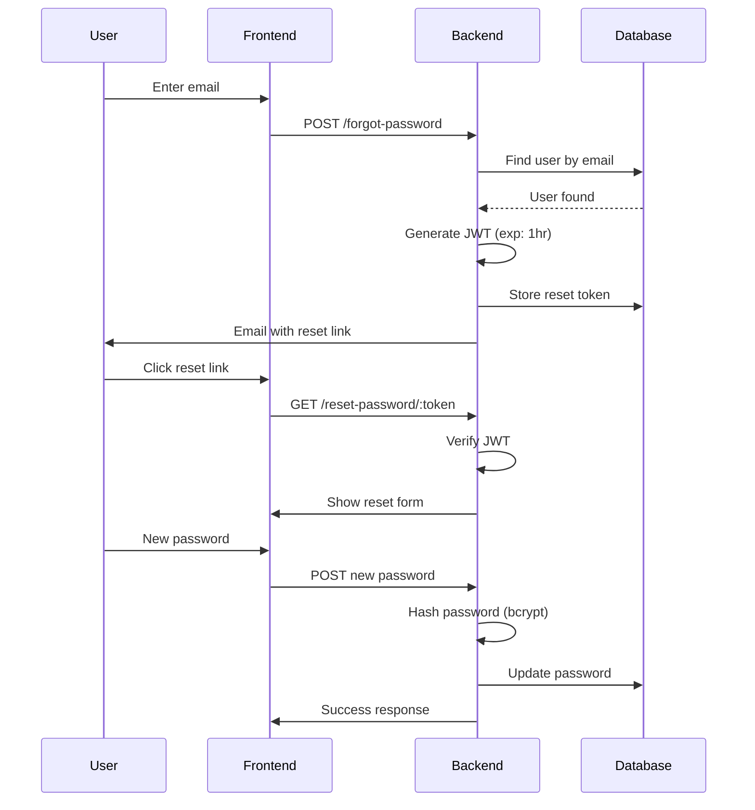

---

## 9. Complete Data Flow

### 9.1 User Registration Flow

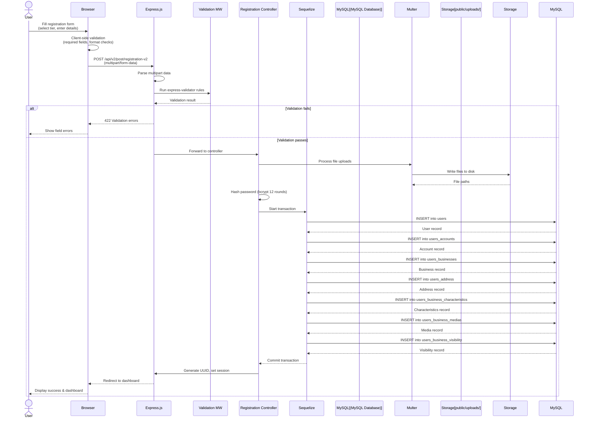

**Step-by-Step:**

1. **User fills form** — Selects business tier (1-4) and enters personal, business, and contact details
2. **Client validation** — jQuery checks required fields, email format, password length
3. **HTTP Request** — Browser sends multipart POST to the v2 registration endpoint
4. **Multer parsing** — Express's Multer middleware parses the multipart form and extracts files
5. **Server validation** — `express-validator` rules check field formats, lengths, required fields
6. **File upload** — Multer writes uploaded files (logo, banner, video, brochure, webinar) to `public/uploads/`
7. **Password hashing** — bcrypt hashes the plaintext password with 12 salt rounds
8. **Database transaction** — Sequelize wraps all inserts in a transaction:
   - `users` — personal info (name, gender, UUID)
   - `users_accounts` — credentials (email, password, type, verification code)
   - `users_businesses` — company profile (name, contact, address, hours)
   - `users_address` — physical address
   - `users_business_characteristics` — industry, categories, products
   - `users_business_medias` — uploaded file references
   - `users_business_visibility` — who can see this business
9. **Session creation** — On success, `req.session.userId` and `req.session.userType` are set
10. **Redirect** — Browser redirects to the profile/dashboard page

### 9.2 Login Flow

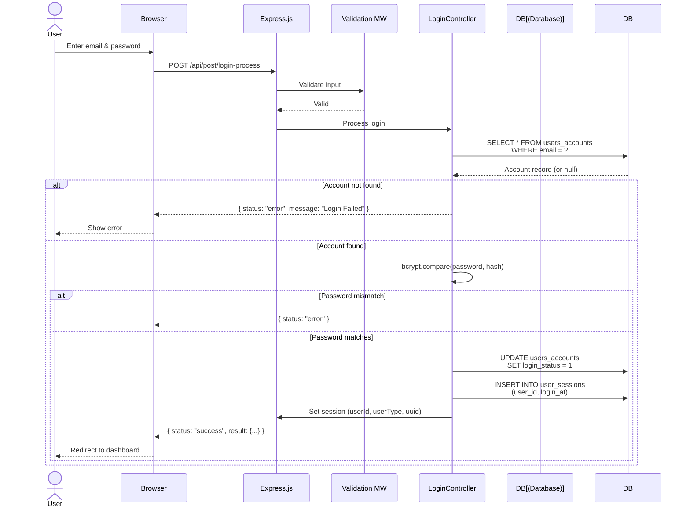

**Step-by-Step:**

1. **Credential submission** — User submits email + password + tier type via login form
2. **Validation** — Express-validator checks for required fields and email format
3. **Lookup** — Controller queries `users_accounts` by email and type
4. **Password verification** — bcrypt.compare() validates the password against stored hash
5. **Session creation** — On match, controller:
   - Sets `login_status = 1` in database
   - Records login in `user_sessions`
   - Sets `req.session` properties (userId, userType, uuid)
6. **Response** — Returns success JSON; frontend redirects to profile/home

### 9.3 Company Search Flow

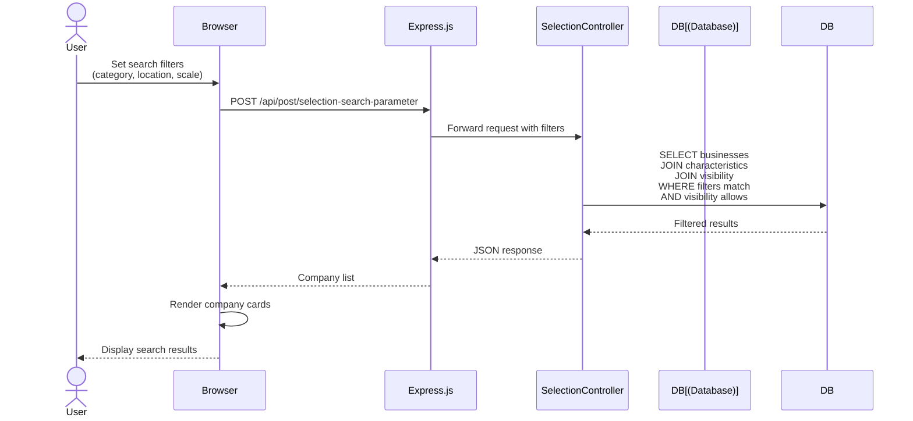

**Step-by-Step:**

1. **Filter selection** — User selects criteria from dropdowns (trade category, sub-category, location, scale)
2. **AJAX request** — jQuery sends POST with filter parameters
3. **Query construction** — Controller dynamically builds SQL with JOINs across:
   - `users_businesses` — business name, location, contact
   - `users_business_characteristics` — categories, products, scale
   - `users_business_visibility` — geographic and audience visibility scope
4. **Result rendering** — Server returns JSON; jQuery renders company cards in the browser
5. **User interaction** — User can click a company to view full profile or initiate contact

### 9.4 Video Meeting Flow

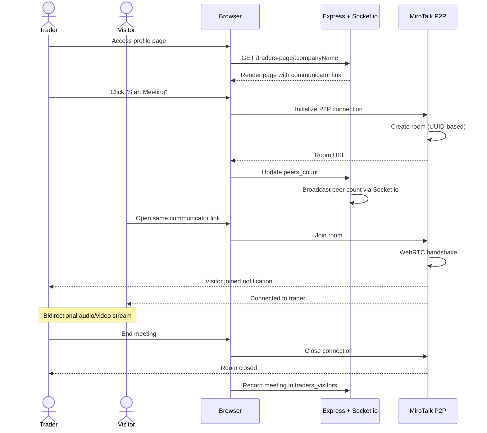

### 9.5 File Upload Flow

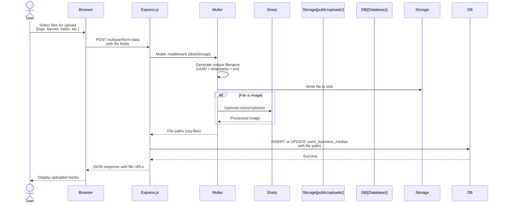

---

## 10. Database Design

### 10.1 Database Overview

| Property | Value |
|----------|-------|
| **Engine** | MySQL |
| **Database Name** | `awt_prod_db_02_01` |
| **ORM** | Sequelize 6 (primary) + mysql2 (legacy) |
| **Character Set** | utf8mb4 (inferred) |
| **Timezone** | Asia/Manila (PHST) |

### 10.2 Table Catalog

| Table | Purpose | Records |
|-------|---------|---------|
| `users` | Personal identity data (name, gender, status) | Core entity |
| `users_accounts` | Authentication credentials, contact info | Core entity |
| `users_businesses` | Business profile details | Core entity |
| `users_address` | Physical address | 1:1 with users |
| `users_business_characteristics` | Industry, categories, products | 1:1 with businesses |
| `users_business_medias` | Uploaded media references | 1:1 with businesses |
| `users_business_visibility` | Visibility scope settings | 1:1 with businesses |
| `reset_tokens` | Password reset tokens | Temporal |
| `user_sessions` | Login/logout timestamps | Temporal |
| `user_download_histories` | PDF download records | Temporal |
| `traders_visitors` | Meeting connection records | Temporal |
| `contact_requests` | Contact messages | Temporal |
| `support_accounts` | Help desk agent accounts | Supporting |
| `support_links` | Support communicator assignments | Supporting |
| `support_messages` | Support chat messages | Supporting |
| `prospects` | Email marketing contacts | Supporting |

### 10.3 Table Schemas

#### `users`

| Column | Type | Constraints | Description |
|--------|------|-------------|-------------|
| `id` | INT | PK, AUTO_INCREMENT | Primary key |
| `first_name` | VARCHAR(255) | NOT NULL | User's first name |
| `last_name` | VARCHAR(255) | NOT NULL | User's last name |
| `middle_name` | VARCHAR(255) | NULLABLE | Middle name |
| `gender` | TINYINT | NOT NULL | 0=unspecified, 1=male, 2=female |
| `status` | TINYINT | DEFAULT 1 | 0=inactive, 1=active |
| `type` | TINYINT | NOT NULL | 1=Trader, 2=Large, 3=Medium, 4=Small |
| `uuid` | VARCHAR(36) | UNIQUE, NOT NULL | UUID v4 for public reference |

#### `users_accounts`

| Column | Type | Constraints | Description |
|--------|------|-------------|-------------|
| `id` | INT | PK, AUTO_INCREMENT | Primary key |
| `email_or_social_media` | VARCHAR(255) | UNIQUE, NOT NULL | Login identifier |
| `social_media_contact_type` | TINYINT | NULLABLE | 1=Viber, 2=WeChat, 3=WhatsApp |
| `contact_number` | VARCHAR(50) | NULLABLE | Phone number |
| `password` | VARCHAR(255) | NOT NULL | bcrypt hash |
| `type` | TINYINT | NOT NULL | Business tier (1-4) |
| `status` | TINYINT | DEFAULT 0 | 0=pending, 1=verified, 2=disabled |
| `verification_code` | VARCHAR(10) | NULLABLE | Email verification code |
| `login_status` | TINYINT | DEFAULT 0 | 0=logged out, 1=logged in |
| `uuid` | VARCHAR(36) | UNIQUE, NOT NULL | UUID v4 |

#### `users_businesses`

| Column | Type | Constraints | Description |
|--------|------|-------------|-------------|
| `id` | INT | PK, AUTO_INCREMENT | Primary key |
| `business_name` | VARCHAR(255) | NOT NULL | Company name |
| `business_email` | VARCHAR(255) | NULLABLE | Company email |
| `business_contact` | VARCHAR(50) | NULLABLE | Company phone |
| `business_tagline` | VARCHAR(255) | NULLABLE | Short description |
| `business_website` | VARCHAR(255) | NULLABLE | Company website |
| `business_language_of_communication` | TEXT | NULLABLE | Preferred languages |
| `business_social_media_contact_type` | TINYINT | NULLABLE | Social media type |
| `business_social_media_contact_number` | VARCHAR(255) | NULLABLE | Social media handle |
| `business_address` | VARCHAR(255) | NULLABLE | Street address |
| `business_country` | VARCHAR(2) | NULLABLE | ISO 3166-1 alpha-2 |
| `business_states` | VARCHAR(255) | NULLABLE | State/province |
| `business_city` | VARCHAR(255) | NULLABLE | City |
| `region_of_operation` | VARCHAR(255) | NULLABLE | Global region |
| `start_operating_hour` | VARCHAR(10) | NULLABLE | HH:mm format |
| `end_operating_hour` | VARCHAR(10) | NULLABLE | HH:mm format |
| `communicator` | TEXT | NULLABLE | MiroTalk meeting URL |
| `peers_count` | TINYINT | DEFAULT 0 | Active meeting participants |
| `status` | TINYINT | DEFAULT 0 | 0=draft, 1=published |
| `isPaid` | TINYINT | DEFAULT 0 | 0=free, 1=paid account |
| `uuid` | VARCHAR(36) | UNIQUE, NOT NULL | UUID v4 |

#### `users_business_characteristics`

| Column | Type | Constraints | Description |
|--------|------|-------------|-------------|
| `id` | INT | PK, AUTO_INCREMENT | Primary key |
| `business_industry_belong_to` | VARCHAR(100) | NULLABLE | Primary industry |
| `business_industry_matching_target` | VARCHAR(100) | NULLABLE | Target industry |
| `business_scale` | TINYINT | NULLABLE | Scale indicator |
| `business_major_category` | VARCHAR(100) | NULLABLE | Trade category |
| `business_sub_category` | VARCHAR(100) | NULLABLE | Trade sub-category |
| `business_minor_sub_category` | VARCHAR(100) | NULLABLE | Minor sub-category |
| `top_products_services` | TEXT | NULLABLE | Products/services list |
| `status` | TINYINT | DEFAULT 0 | Active status |
| `uuid` | VARCHAR(36) | UNIQUE, NOT NULL | UUID v4 |

#### `users_business_medias`

| Column | Type | Constraints | Description |
|--------|------|-------------|-------------|
| `id` | INT | PK, AUTO_INCREMENT | Primary key |
| `logo` | VARCHAR(255) | NULLABLE | Logo file path |
| `banner` | VARCHAR(255) | NULLABLE | Banner image path |
| `video_thumbnail` | VARCHAR(255) | NULLABLE | Video thumbnail path |
| `video_link` | VARCHAR(255) | NULLABLE | Video URL |
| `video_title` | VARCHAR(255) | NULLABLE | Video title |
| `video_description` | TEXT | NULLABLE | Video description |
| `brochure` | VARCHAR(255) | NULLABLE | PDF brochure path |
| `brochure_title` | VARCHAR(255) | NULLABLE | Brochure title |
| `webinars_thumbnail` | VARCHAR(255) | NULLABLE | Webinar thumbnail |
| `webinars_title` | VARCHAR(255) | NULLABLE | Webinar title |
| `webinars_description` | TEXT | NULLABLE | Webinar description |
| `webinars_link` | VARCHAR(255) | NULLABLE | Webinar URL |
| `webinars_schedule` | DATETIME | NULLABLE | Webinar date/time |
| `status` | TINYINT | DEFAULT 0 | Active status |
| `uuid` | VARCHAR(36) | UNIQUE, NOT NULL | UUID v4 |
| `date_created` | DATETIME | DEFAULT NOW() | Creation timestamp |

#### `users_business_visibility`

| Column | Type | Constraints | Description |
|--------|------|-------------|-------------|
| `id` | INT | PK, AUTO_INCREMENT | Primary key |
| `i_operate_on_a_world_wide_level` | TINYINT | DEFAULT 0 | Visible globally |
| `i_operate_on_a_global_regional_level` | TINYINT | DEFAULT 0 | Visible regionally |
| `i_operate_on_a_national_level` | TINYINT | DEFAULT 0 | Visible nationally |
| `i_operate_on_a_state_level` | TINYINT | DEFAULT 0 | Visible state-wide |
| `i_operate_on_a_city_level` | TINYINT | DEFAULT 0 | Visible city-wide |
| `visible_to_micro_small_retailers` | TINYINT | DEFAULT 0 | Visible to small retailers |
| `visible_to_btb_medium_large_wholesale_highend` | TINYINT | DEFAULT 0 | Visible to B2B mid-large |
| `visible_to_large_scale_and_highend_business` | TINYINT | DEFAULT 0 | Visible to large enterprises |
| `uuid` | VARCHAR(36) | UNIQUE, NOT NULL | UUID v4 |

### 10.4 Index Strategy

| Table | Indexed Columns | Purpose |
|-------|----------------|---------|
| `users_accounts` | `email_or_social_media` | Fast login lookups |
| `users_accounts` | `uuid` | User lookups via UUID |
| `users_businesses` | `business_name` | Business name search |
| `users_businesses` | `business_country` | Geographic filtering |
| `users_businesses` | `uuid` | Business lookups |
| `users_business_characteristics` | `business_major_category` | Category filtering |
| `users_business_characteristics` | `business_sub_category` | Sub-category filtering |
| `users` | `uuid` | User lookups |

### 10.5 Optimization Strategy

- **Query optimization**: Legacy raw SQL queries are hand-tuned; Sequelize queries use eager loading (`include`) to reduce N+1
- **Connection pooling**: Both mysql2 pool and Sequelize connection pool are configured
- **Pagination**: Search results support limit/offset for large result sets
- **Indexing**: Key search columns are indexed (category, location, name)
- **Denormalization**: Some visibility and characteristic fields are stored directly on the business profile to avoid excessive JOINs

---

## 11. Entity Relationship Diagram

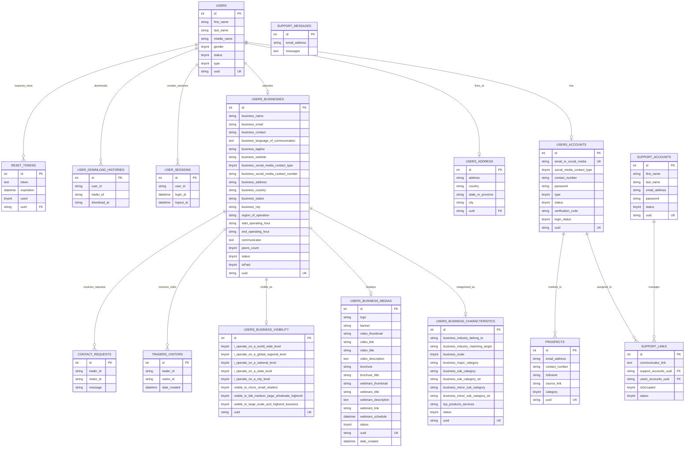

### Relationship Explanations

| Relationship | Type | Description |
|-------------|------|-------------|
| `users` → `users_accounts` | **One-to-One** | Each user has exactly one account record for authentication |
| `users` → `users_address` | **One-to-One** | Each user has one physical address |
| `users` → `users_businesses` | **One-to-One** | Each user operates exactly one business profile |
| `users_businesses` → `users_business_characteristics` | **One-to-One** | Each business has one set of characteristic classifications |
| `users_businesses` → `users_business_medias` | **One-to-One** | Each business has one media record (with multiple file fields) |
| `users_businesses` → `users_business_visibility` | **One-to-One** | Each business has one visibility configuration |
| `users_businesses` → `traders_visitors` | **One-to-Many** | A business can receive many visitor connection records |
| `users_businesses` → `contact_requests` | **One-to-Many** | A business can receive many contact requests |
| `users` → `user_sessions` | **One-to-Many** | A user creates many login sessions over time |
| `users` → `user_download_histories` | **One-to-Many** | A user can download many PDF records |
| `users` → `reset_tokens` | **One-to-Many** | A user can request many password resets |
| `users_accounts` → `support_links` | **One-to-Many** | A user can be assigned to support links |
| `support_accounts` → `support_links` | **One-to-Many** | A support agent can manage many support links |

**Note:** Relationships are logical (via UUID foreign keys) rather than enforced as database-level foreign key constraints. The `uuid` column serves as the linking identifier across tables.

---

## 12. Authentication & Security

### 12.1 Authentication Architecture

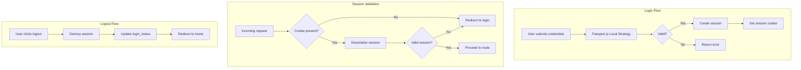

### 12.2 Security Measures

| Measure | Implementation | Purpose |
|---------|---------------|---------|
| **Password Hashing** | bcrypt, 12 rounds | Prevents plaintext exposure in database breaches |
| **Session Encryption** | `express-session` with secret | Prevents session tampering |
| **UUID Over ID** | Public references use UUID v4 | Prevents sequential ID enumeration attacks |
| **AES Encryption** | CryptoJS AES for communicator UUIDs | Protects sensitive meeting identifiers |
| **Input Validation** | express-validator middleware | Prevents injection and malformed input |
| **Helmet (available)** | HTTP security headers (commented out) | CSP, XSS, clickjacking protection |
| **SSL/TLS** | Self-signed certificates in `app/ssl/` | Encrypts data in transit |
| **Verification Codes** | Email verification on registration | Confirms email ownership |
| **Login Status Tracking** | `users_accounts.login_status` | Detects concurrent sessions |

### 12.3 RBAC (Role-Based Access Control)

| Role | Type Value | Access |
|------|-----------|--------|
| Trader | 1 | Own profile, search, video meetings, connections |
| Large Company | 2 | Own profile, search, video meetings, connections |
| Medium Company | 3 | Own profile, search, video meetings, connections |
| Small Company | 4 | Own profile, search, video meetings, connections |
| Support Agent | N/A (support_accounts) | Support communicator management, chat |

Access control is enforced via middleware that checks `req.session.userType` before rendering tier-specific pages or processing updates.

### 12.4 API Security

- API key authentication for MiroTalk meeting API (`API_KEY_SECRET`)
- Session cookie for web application routes
- No public registration (email verification required)
- Rate limiting should be implemented at the reverse proxy layer

---

## 13. Deployment Architecture

### 13.1 Current Deployment Model

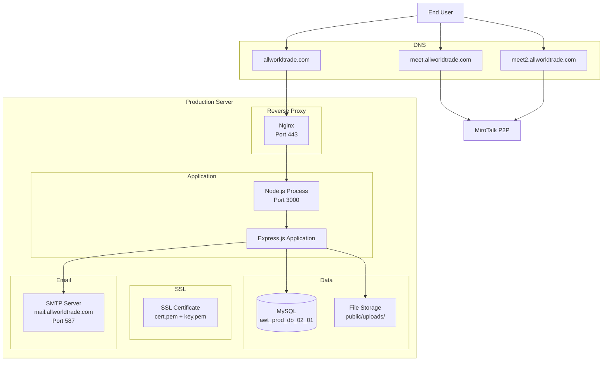

### 13.2 Deployment Steps

**1. Production Deployment (Manual)**

```bash
# Pull latest code
git pull origin main

# Install dependencies
npm install --production

# Build frontend assets
npm run tailwindBuild
npm run webpackBuild

# Set environment variables
export NODE_ENV=production

# Start application (production)
npm start
```

**2. Process Management**

The application runs as a single Node.js process. For production resilience, use a process manager:

```bash
# Using PM2 (recommended)
npm install -g pm2
pm2 start app/src/server.js --name allworldtrade
pm2 save
pm2 startup
```

**3. Reverse Proxy (Nginx)**

```nginx
server {
    listen 443 ssl;
    server_name allworldtrade.com;

    ssl_certificate /path/to/cert.pem;
    ssl_certificate_key /path/to/key.pem;

    location / {
        proxy_pass http://127.0.0.1:3000;
        proxy_http_version 1.1;
        proxy_set_header Upgrade $http_upgrade;
        proxy_set_header Connection 'upgrade';
        proxy_set_header Host $host;
        proxy_cache_bypass $http_upgrade;
        proxy_set_header X-Real-IP $remote_addr;
        proxy_set_header X-Forwarded-For $proxy_add_x_forwarded_for;
        proxy_set_header X-Forwarded-Proto $scheme;
    }

    location /socket.io/ {
        proxy_pass http://127.0.0.1:3000;
        proxy_http_version 1.1;
        proxy_set_header Upgrade $http_upgrade;
        proxy_set_header Connection 'upgrade';
        proxy_set_header Host $host;
        proxy_set_header X-Real-IP $remote_addr;
    }
}
```

### 13.3 Environment-Specific Configuration

| Environment | Configuration | Purpose |
|-------------|---------------|---------|
| **Local** | `.env` with localhost DB, port 3000 | Development |
| **Dev** | `dev.allworldtrade.com`, separate DB | Staging/QA |
| **Production** | `allworldtrade.com`, production DB | Live |

### 13.4 Backup Strategy

- **Database**: Scheduled MySQL dumps (`mysqldump`)
- **Uploads**: Periodic rsync/copy of `public/uploads/`
- **SSL certificates**: Regular renewal monitoring

---

## 14. Environment Configuration

### 14.1 Environment Variables

```env
# =====================
# DATABASE CONFIGURATION
# =====================
DB_SERVERHOST=          # MySQL server hostname
DB_USERNAME=            # MySQL database user
DB_PASSWORD=            # MySQL database password
DB_NAME=                # MySQL database name
DB_DIALECT=             # Database dialect (mysql)

# =====================
# APPLICATION CONFIGURATION
# =====================
PORT=                   # Application listen port
NODE_ENV=               # Environment (localhost/production)
AWT_HOSTNAME=           # Public-facing base URL

# =====================
# SECURITY CONFIGURATION
# =====================
API_KEY_SECRET=         # MiroTalk meeting API key
SESSION_SECRET=         # Session encryption secret
JWT_SECRET=             # JWT signing secret

# =====================
# EMAIL CONFIGURATION (SMTP)
# =====================
EMAIL_SERVERHOST=       # SMTP server host
EMAIL_PORT=             # SMTP port (587=STARTTLS)
EMAIL_SECURE=           # Use TLS (false for STARTTLS)
EMAIL_USER=             # SMTP username
EMAIL_PASSWORD=         # SMTP password
EMAIL_SENDER_ADDRESS=   # From address

# =====================
# NOTIFICATION EMAILS
# =====================
PAYMENT_EMAIL_ADDRESS=              # Payment notifications
SUPPORT_RECEIVER_EMAIL_ADDRESS=     # Support tickets
```

### 14.2 Variable Explanations

| Variable | Purpose | Security Level |
|----------|---------|----------------|
| `DB_SERVERHOST` | MySQL host — localhost for single-server, private IP for distributed | Internal |
| `DB_USERNAME` / `DB_PASSWORD` | Database credentials | **Secret** |
| `PORT` | Application listen port (3000 dev, 443 behind Nginx) | Low |
| `SESSION_SECRET` | Used by `express-session` to sign cookies | **Secret** |
| `JWT_SECRET` | Signs password reset JWT tokens | **Secret** |
| `API_KEY_SECRET` | Authenticates MiroTalk meeting API requests | **Secret** |
| `EMAIL_PASSWORD` | SMTP authentication | **Secret** |
| `NODE_ENV` | Controls error verbosity, static file caching | Low |

---

## 15. Installation & Setup

### 15.1 Prerequisites

| Dependency | Version | Purpose |
|-----------|---------|---------|
| **Node.js** | >= 18.x | JavaScript runtime |
| **npm** | >= 9.x | Package manager |
| **MySQL** | >= 8.x | Database server |
| **Git** | Any | Version control |

### 15.2 Local Development Setup

```bash
# 1. Clone the repository
git clone <repository-url> all-world-trade-v11
cd all-world-trade-v11

# 2. Install dependencies
npm install

# 3. Configure environment
cp .env.example .env
# Edit .env with your local MySQL credentials

# 4. Create the database
mysql -u root -p -e "CREATE DATABASE IF NOT EXISTS awt_prod_db_02_01"

# 5. Run database migrations (Sequelize)
npx sequelize-cli db:migrate

# 6. Build frontend assets
npm run tailwindBuild
npm run webpackBuild

# 7. Start development server
npm run dev
```

### 15.3 Available Scripts

| Script | Command | Description |
|--------|---------|-------------|
| `npm run dev` | `nodemon app/src/server.js` | Start with hot-reload for development |
| `npm start` | `node app/src/server.js` | Start production server |
| `npm run tailwindBuild` | `npx @tailwindcss/cli -i ... -o ...` | Build Tailwind CSS |
| `npm run webpackBuild` | `npx webpack --mode=production` | Bundle JavaScript |
| `npm run lint` | `npx prettier --check .` | Check code formatting |

### 15.4 Database Migrations

```bash
# Run pending migrations
npx sequelize-cli db:migrate

# Create a new migration
npx sequelize-cli migration:generate --name migration-name

# Undo last migration
npx sequelize-cli db:migrate:undo
```

**Note:** The codebase also synchronizes models via `app/db_models/index.js` using `sequelize.sync()`. This creates tables based on model definitions. Migrations are used for the `reset_tokens` and `users` tables only.

### 15.5 Accessing the Application

| URL | Description |
|-----|-------------|
| `http://localhost:3000` | Home page |
| `http://localhost:3000/login` | Login page |
| `http://localhost:3000/registration` | Registration |
| `http://localhost:3000/selection` | Company search |

---

## 16. Technology Stack

### 16.1 Technology Table

| Layer | Technology | Version | Purpose |
|-------|-----------|---------|---------|
| **Runtime** | Node.js | >= 18.x | JavaScript server runtime |
| **Web Framework** | Express.js | 5.x | HTTP server, routing, middleware |
| **Template Engine** | EJS | 3.x | Server-side HTML rendering |
| **CSS Framework** | Tailwind CSS | 4.x | Utility-first styling |
| **UI Kit** | UIKit | 3.x | Component library (modals, tabs, grids) |
| **UI Components** | Flowbite | Latest | Tailwind-based interactive components |
| **JS Bundler** | Webpack | 5.x | JavaScript bundling and minification |
| **ORM** | Sequelize | 6.x | Database abstraction, migrations |
| **Database Driver** | mysql2 | Latest | MySQL connection and queries |
| **Auth** | Passport.js (Local) | Latest | Authentication strategy |
| **Real-time** | Socket.io | 4.x | WebRTC signaling, peer counting |
| **Video** | MiroTalk P2P | Latest | WebRTC video meetings |
| **Email** | Nodemailer | Latest | SMTP email sending |
| **Email Templates** | Handlebars | Latest | Email template engine |
| **File Upload** | Multer | Latest | Multipart file handling |
| **Image Processing** | Sharp | Latest | Image resize/optimize |
| **PDF Generation** | PDFKit | Latest | Dynamic PDF document creation |
| **Scheduling** | node-cron | Latest | Cron job execution |
| **Validation** | express-validator | Latest | Input validation middleware |
| **Password Hashing** | bcrypt | Latest | Secure password storage |
| **Encryption** | crypto-js (AES) | Latest | UUID/session encryption |
| **CSS Preprocessor** | PostCSS (via Tailwind) | Latest | CSS transformation |
| **Icons** | Ionicons | Latest | Icon library |
| **Alerts** | SweetAlert2 | Latest | Modal dialogs and notifications |
| **Tooltips** | Tippy.js | Latest | Tooltip components |

### 16.2 Why Each Technology Was Chosen

| Technology | Rationale |
|-----------|-----------|
| **Node.js + Express** | Lightweight, non-blocking I/O; large ecosystem; well-suited for I/O-heavy applications like this one |
| **EJS** | Simple, familiar syntax; no client-side framework overhead; fast server-side rendering |
| **Tailwind CSS** | Utility-first approach reduces CSS bloat; JIT engine generates only used styles |
| **Sequelize** | Mature ORM with MySQL support; migrations, associations, and transaction support |
| **Passport.js** | Modular, extensible auth middleware; simple local strategy integration |
| **Socket.io** | Reliable real-time bidirectional communication with auto-reconnect and fallback |
| **MiroTalk P2P** | Lightweight WebRTC library; no server-side media processing needed |
| **Multer** | De facto standard for Express file uploads; flexible disk storage configuration |
| **Nodemailer** | Stable, well-documented email library with Handlebars template integration |

---

## 17. Scalability & Performance

### 17.1 Current Performance Characteristics

| Aspect | Current State |
|--------|---------------|
| **Page rendering** | Server-side (EJS) — initial load is fast, subsequent navigation reloads full pages |
| **Database queries** | Mixed — some optimized with indexes, some use raw SQL with full table scans |
| **Static assets** | Served directly by Express (not CDN) |
| **Session storage** | In-memory (not suitable for multi-process deployment) |
| **Concurrency** | Single Node.js process handles all requests |

### 17.2 Scalability Roadmap

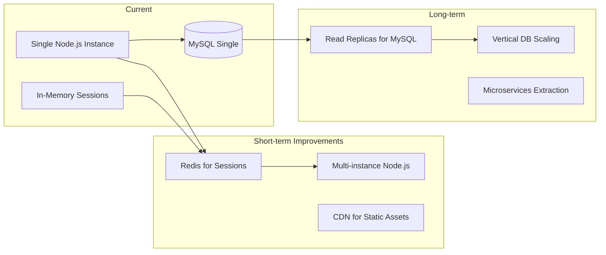

### 17.3 Optimization Strategies

| Area | Strategy | Benefit |
|------|----------|---------|
| **Database** | Add missing indexes on frequently queried columns | Faster search queries |
| **Database** | Convert legacy raw SQL to Sequelize ORM | Query optimization, prepared statements |
| **Caching** | Implement Redis caching for category/reference data | Reduce DB load |
| **Static Assets** | Serve via CDN (Cloudflare, AWS CloudFront) | Reduced server bandwidth, faster load times |
| **Session Storage** | Move from in-memory to Redis store | Enable horizontal scaling |
| **Lazy Loading** | Lazy-load below-the-fold content | Faster initial page render |
| **Image Optimization** | Sharp already implemented; ensure all uploads are processed | Reduced file sizes |
| **JavaScript** | Split Webpack bundles per-page | Reduced initial JS payload |
| **Connection Pool** | Tune Sequelize and mysql2 pool sizes | Optimal concurrent DB connections |

### 17.4 Database Query Optimization

```sql
-- Example: Add composite index for search queries
CREATE INDEX idx_business_search ON users_businesses (business_country, status);

-- Example: Add index for category filtering
CREATE INDEX idx_characteristics_category ON users_business_characteristics (business_major_category, business_sub_category);
```

---

## 18. Error Handling

### 18.1 Error Handling Architecture

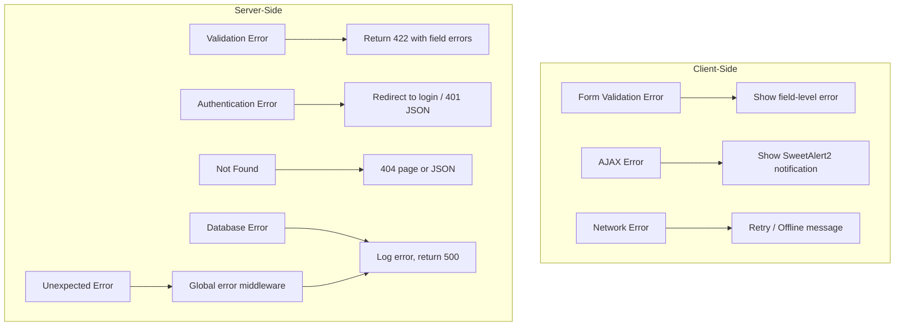

### 18.2 Error Handling Patterns

| Layer | Error Type | Handling |
|-------|-----------|----------|
| **Frontend** | Form validation | jQuery checks before submission; field-level error display |
| **Frontend** | AJAX failure | `.fail()` handler with SweetAlert2 error modal |
| **Frontend** | Server 500 | Generic "Something went wrong" message |
| **Backend** | Validation | express-validator returns `validationResult()` errors as JSON |
| **Backend** | Auth failure | Returns JSON `{ status: "error", message: "Login Failed" }` |
| **Backend** | Database | Try/catch blocks; logs via `Logger` utility; returns 500 |
| **Backend** | 404 | Catch-all route handler |
| **Backend** | Unhandled | Global `app.use((err, req, res, next) => { ... })` middleware |

### 18.3 Logger Utility

```javascript
// app/src/Logger.js
// Provides timestamped console logging with color coding
// Supports: info, warn, error, debug levels
```

### 18.4 Retry Strategy

- **No automatic retry** for failed database operations
- File upload failures return immediately with error
- Email sending failures are logged but do not retry automatically

---

## 19. Testing Strategy

### 19.1 Current Testing Status

The project currently has **no automated test suite**. Tests are performed manually during development. The following outlines the recommended testing strategy.

### 19.2 Recommended Test Structure

```plaintext
tests/
├── unit/
│   ├── controllers/
│   ├── services/
│   │   ├── email.service.test.js
│   │   └── analytics.service.test.js
│   └── utils/
│       └── date.utils.test.js
│
├── integration/
│   ├── api/
│   │   ├── auth.test.js
│   │   ├── registration.test.js
│   │   └── search.test.js
│   └── database/
│       └── models.test.js
│
├── e2e/
│   ├── registration.cy.js       # Cypress test
│   ├── login.cy.js
│   └── search.cy.js
│
└── fixtures/
    ├── users.json
    └── businesses.json
```

### 19.3 Testing Framework Recommendations

| Test Type | Framework | Scope |
|-----------|-----------|-------|
| **Unit** | Jest + Sinon | Service functions, utilities, helpers |
| **Integration** | Jest + Supertest | API endpoints, controller logic |
| **E2E** | Cypress | Full user workflows (login, register, search) |
| **Database** | Jest + Sequelize Test | Model associations, query accuracy |

### 19.4 Example Test

```javascript
// tests/unit/services/email.service.test.js
const emailService = require('../../../app/services/email.service');

describe('Email Service', () => {
    it('should send verification email', async () => {
        const result = await emailService.sendVerification({
            email: 'test@example.com',
            code: 'ABC123'
        });
        expect(result.success).toBe(true);
    });

    it('should fail with invalid email', async () => {
        await expect(
            emailService.sendVerification({
                email: 'not-an-email',
                code: 'ABC123'
            })
        ).rejects.toThrow('Invalid email');
    });
});
```

### 19.5 API Test Example

```javascript
// tests/integration/api/auth.test.js
const request = require('supertest');
const app = require('../../../app/src/server');

describe('POST /api/post/login-process', () => {
    it('should login with valid credentials', async () => {
        const res = await request(app)
            .post('/api/post/login-process')
            .send({
                email_or_social_media: 'test@example.com',
                password: 'correctpassword',
                type: 1
            })
            .expect('Content-Type', /json/)
            .expect(200);

        expect(res.body.status).toBe('success');
    });

    it('should reject invalid password', async () => {
        const res = await request(app)
            .post('/api/post/login-process')
            .send({
                email_or_social_media: 'test@example.com',
                password: 'wrongpassword',
                type: 1
            })
            .expect(200);

        expect(res.body.status).toBe('error');
    });
});
```

---

## 20. Future Improvements

### 20.1 Planned Features

| Feature | Priority | Description |
|---------|----------|-------------|
| **Unified API** | High | Consolidate legacy + v2 + v3 APIs into a single, versioned REST API |
| **OAuth 2.0 / SSO** | Medium | Allow login via Google, LinkedIn, Facebook |
| **Real-time Chat** | Medium | Persistent messaging alongside video meetings |
| **Mobile App** | Low | React Native or Flutter wrapper for the platform |
| **Payment Integration** | Medium | Subscription plans with PayPal/Stripe/Gcash |
| **Advanced Analytics** | Low | Dashboard with charts for user growth, engagement |
| **Multi-language Support** | Medium | i18n for international users |

### 20.2 Technical Improvements

| Improvement | Category | Rationale |
|-------------|----------|-----------|
| **Docker Compose** | Infrastructure | Simplify local development and deployment with containerization |
| **Redis Session Store** | Performance | Enable horizontal scaling with shared session state |
| **ORM Migration** | Code Quality | Convert all legacy raw SQL to Sequelize for consistency |
| **ESLint + Prettier CI** | Code Quality | Enforce consistent code style automatically |
| **Automated Tests** | Quality | Add unit, integration, and E2E test suites |
| **CI/CD Pipeline** | DevOps | GitHub Actions or GitLab CI for automated testing and deployment |
| **TypeScript Migration** | Code Quality | Gradual migration from JavaScript for type safety |
| **Helmet Enablement** | Security | Enable CSP and other security headers |
| **Rate Limiting** | Security | Implement rate limiting on API endpoints |
| **API Documentation** | Developer Experience | Generate OpenAPI/Swagger spec for all endpoints |

### 20.3 Database Improvements

- Add proper foreign key constraints with CASCADE rules
- Normalize the `users_businesses` table (separate operating hours, social media into related tables)
- Add full-text indexes for search performance
- Implement database migration strategy for all schema changes

### 20.4 Security Enhancements

- Enforce strong password policies (minimum length, complexity)
- Implement account lockout after failed login attempts
- Add two-factor authentication (TOTP)
- Enable Helmet middleware for security headers
- Regular security audit of dependencies

---

## Contributing

1. Fork the repository
2. Create a feature branch (`git checkout -b feature/amazing-feature`)
3. Commit your changes (`git commit -m 'Add amazing feature'`)
4. Push to the branch (`git push origin feature/amazing-feature`)
5. Open a Pull Request

## License

All rights reserved. All World Trade — Proprietary software.

---

*Generated for developers, system architects, QA testers, DevOps engineers, and maintainers. For questions, contact care@allworldtrade.com.*
